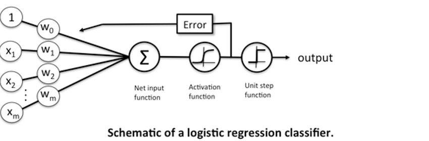
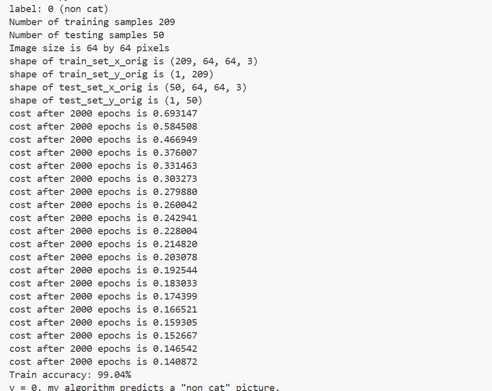

# Logistics-Regression-with-Neural-Network-mindset
Before diving “deep” into Neural Network, it is essential to get a good intuition. What better way than to understand the logic of how the Logistic Regression Algorithm can be modeled as a simple Neural Network that actually learns from data.
The classic application of Logistics regression is binary classification. Logistic regression is useful if we are working with a dataset where the classes are more or less “linearly separable.” Neural networks are somewhat related to logistic regression. Basically, we can think of logistic regression as a one-layer neural network.



It is quite common to use the Logistic sigmoid function as an Activation function. It is more advisable as you get into a deep neural network to use it ONLY for the Output layers. Logistic regression takes an input, passes it through a sigmoid function, then returns an output of probability between 0 and 1. This sigmoid function is responsible for classifying the input.


Ok, I think some visible codes will reveal the notion much better.
To get a good intuition through practical, I will be using a problem set from Andrew Ng Deep Learning AI. We will be building a simple image-recognition algorithm that can correctly classify pictures as cat or non-cat. Before I go forward, you will need to have some basic understanding of the following or else it might seem like a foreign language.
## Prerequisites
•	Image processing

•	[Python](https://www.python.org/doc/)

•	[NumPy](https://numpy.org/doc/)

•	Linear algebra

•	Calculus

I will try to give a step by step instructions for the coding of the problem set. The full code can also be found on my Github, the link will be attached. First, we want to import all the necessary packages.


Next is to preprocess the data. I will be using an h5 file containing images of cats and other images that are non-cats. [Cat Dataset on Kaggle](https://www.kaggle.com/datasets/crawford/cat-dataset)
 to the Cat dataset. We are working with 209 training and 50 test examples, and a pixels value of 64 x 64 x 3, which is not much to let our model reach its full potential to learn, but it will do for the sake of intuition. The number I just stated are the values that represent the images of the dataset. The images will be the input we feed into our logistics regression. An image is a 3-dimensional matrix that holds pixel intensity values of Red, Green, and Blue channel. In order to feed it into our network, we will convert this image (3d-matrix ) to a 1d-matrix, vector.
A single train image is of dimension [64, 64, 3] where 64, is the width, 64 is the height and 3 is the number of channels, when flattened to a 1-dim image, we get [1, 12288]. The image below should help you understand better.


Moving forward, we know a flattened vector will have a dimension [1, 12288], note that we have 209 training examples and 50 test examples. Thus we will end up having:

•	An array of dimension [12288,209] to hold our train images.

•	An array of dimension[12288,50] to hold our test images.

•	An array of dimension [1,209] to hold our train labels.

•	An array of dimension [1,50]to hold our test labels.

After flattening our image, we Standardize. One common preprocessing step in machine learning is to center and standardize your dataset, meaning that you subtract the mean of the whole numpy array from each example, and then divide each example by the standard deviation of the whole numpy array. But for picture datasets, it is simpler and more convenient and works almost as well to just divide every row of the dataset by 255 (the maximum value of a pixel channel). A quick recap of the first segment : Figure out the dimensions and shapes of the problem (m_train, m_test, num_px, …). Reshape the datasets such that each example is now a vector of size (num_px * num_px * 3, 1). “Standardize” the data.


Our data has been preprocessed. Let’s get to building our logistics regression model that will classify cats. Remember the idea here is to understand the mindset of Neural Networks using Logistics Regression. LR is pretty much a one-layer neural network


Let me explains some basic concepts in regard to the above image.
Neuron- a neuron(where we have w x +b, within the circle in the above image) in deep learning, is a biologically inspired representation of a neuron inside the human brain. Similar to a neuron in the human brain, an artificial neuron accepts inputs from some other neurons and fires a value to the next set of artificial neurons. Inside a single neuron, two computations are performed. Weighted and Activation.
Weighted sum- Every input value x to an artificial neuron has a weight w attached to it, which tells about the relative importance of that input with other inputs. Each weight is multiplied with its corresponding input and gets summed up to produce a single value z.
Activation- After computing the weighted sum z, an activation function a=g(z) is applied to this weighted sum z. An activation function is a simple mathematical transformation of an input value to an output value by introducing a non-linearity. This is necessary because real-world inputs are non-linear and we need our neural network to learn this non-linearity somehow.
Logistics Regression Concept: These are the steps we will be carrying out to build the model algorithm
###  Mathematical Expression for the Algorithm

Initialize the weights `w` and biases `b` to random values (say 0 or using random distribution).

For each training sample in the dataset:

- Calculate the output value `( a^{(i)} )` for an input sample `(x^{(i)})`.
- First: find out the weighted sum `( z^{(i)})`.
- Second: compute the activation value `( a^{(i)} = y'^{(i)} = g(z^{(i)}))` for the weighted sum `( z^{(i)})`.
- As we know the true label for this input training sample \( y^{(i)} \), we use that to find the loss `( L(a^{(i)}, y^{(i)}))`.

Calculate the cost function `( J )`, which is the sum of all losses divided by the number of training examples `(m)`, i.e.,

`J = (1/m) * Σ L(a(i), y(i))`

To minimize the cost function, compute the gradients for parameters `dJ/dw`  and `dJ/db` using the chain rule of calculus.

Use gradient descent to update the parameters **w** and **b**.

Perform the above procedure until the cost function becomes minimum.

---

####  The mathematical expressions for our algorithm:

1. **Weighted Sum of the ith training example:**

`z(i) = wᵀx(i) + b`

Here “\( .T \)” stands for Transpose.

2. **Activation of the ith training example (using sigmoid):**

`y′(i) = a(i) = σ(z(i)) = 1 / (1 + e^(−z(i)))`

3. **Loss function of the ith training example:**

`L(a(i), y(i)) = −y(i)log(a(i)) − (1 − y(i))log(1 − a(i))`

4. **Cost function for all training examples:**

`J = (1/m) * Σ L(a(i), y(i))`

`J = −(1/m) * Σ [ y(i)log(a(i)) + (1 − y(i))log(1 − a(i)) ]`

5. ** Gradient Descent w.r.t cost function, weights and bias **

`dJ/dw = (1/m) * X(A − Y)ᵀ`

`dJ/db = (1/m) * Σ (a(i) − y(i))`

6. ** Parameters update rule **
   
`w = w − α * (dJ/dw)`

`b = b − α * (dJ/db)`
Note, we will be implementing vectorization, meaning instead of looping through each 209 training example, which will slow thing down, we will combine them, using numpy library. The below image should give a better understanding how dimensions of the numpy array should like.


I know everything can seems a little too much at once, I’ll advise to go over it a couple of a times and also once it implemented in code, you should get a better understanding.
Lets code:
Let’s build our helper function- sigmoid.
```
def sigmoid(z):
    """
    Compute the sigmoid of z    Arguments:
    z -- A scalar or numpy array of any size.    Return:
    s -- sigmoid(z)
    """    ### START CODE HERE ### (≈ 1 line of code)
    s = 1/(1 + np.exp(-z))
    ### END CODE HERE ###
    
    return s
```
Next, Initialize the weights w and biases b to random values
```
def initialize_with_zeros(dim):
    """
    This function creates a vector of zeros of shape (dim, 1) for w and initializes b to 0.
    
    Argument:
    dim -- size of the w vector we want (or number of parameters in this case)
    
    Returns:
    w -- initialized vector of shape (dim, 1)
    b -- initialized scalar (corresponds to the bias)
    """
    
    ### START CODE HERE ### (≈ 1 line of code)
    w = np.zeros((dim, 1))
    b = 0
    ### END CODE HERE ###    
    return w, b
```
Now that your parameters are initialized, you can do the “forward” and “backward” propagation steps for learning the parameters.

```
def propagate(w, b, X, Y):
	# num of training samples
	m = X.shape[1]	# forward pass
	A    = sigmoid(np.dot(w.T,X) + b)
	cost = (-1/m)*(np.sum(np.multiply(Y,np.log(A)) + np.multiply((1-Y),np.log(1-A))))	# back propagation
	dw = (1/m)*(np.dot(X, (A-Y).T))
	db = (1/m)*(np.sum(A-Y))
 cost = np.squeeze(cost)	# gradient dictionary
	grads = {"dw": dw, "db": db}	return grads, cost
```

Once a cost is received, we need to minimize the cost, pretty much just reducing errors. This is done by computing gradient for the parameters using the chain rule of calculus. The graph below shows the intuition behind gradient descent in search of the cost minimum. The ball going down the hill fast or slow, depending on the learning rate you choose to apply to it. Think of this ball seeking for the best parameter to learn your data effectively.


Computional graph for gradient descent


OK apologizes if any headache. Let's get back to coding. Optimization
•	You have initialized your parameters.

•	You are also able to compute a cost function and its gradient.

•	Now, you want to update the parameters using gradient descent.

```
def optimize(w, b, X, Y, epochs, lr):
	costs = []
	for i in range(epochs):
		# calculate gradients
		grads, cost = propagate(w, b, X, Y)

		# get gradients
		dw = grads["dw"]
		db = grads["db"]

		# update rule
		w = w - (lr*dw)
		b = b - (lr*db)

		if i % 100 == 0:
			costs.append(cost)
			print("cost after %i epochs: %f" %(i, cost))

	# param dict
	params = {"w": w, "b": b}

	# gradient dict
	grads  = {"dw": dw, "db": db}

	return params, grads, costs
```

Calculate Ŷ = A = σ(wᵀX + b)
Convert the entries of a into `0` `(if activation <= 0.5)` or `1` `(if activation > 0.5)`, stores the predictions in a vector `Y_prediction`. If you wish, you can use an `if/else` statement in a `for` loop (though there is also a way to vectorize this).

```
def predict(w, b, X):
	m = X.shape[1]
	Y_predict = np.zeros((1,m))
	w = w.reshape(X.shape[0], 1)

	A = sigmoid(np.dot(w.T, X) + b)

	for i in range(A.shape[1]):
		if A[0, i] <= 0.5:
			Y_predict[0, i] = 0
		else:
			Y_predict[0,i]  = 1

	return Y_predict
```
Now lets merge all function into a model
```
def model(X_train, Y_train, X_test, Y_test, epochs, lr):
	w, b = init_params(X_train.shape[0])
	params, grads, costs = optimize(w, b, X_train, Y_train, epochs, lr)

	w = params["w"]
	b = params["b"]

	Y_predict_train = predict(w, b, X_train)
	Y_predict_test  = predict(w, b, X_test)

	print("train_accuracy: {} %".format(100-np.mean(np.abs(Y_predict_train - Y_train)) * 100))
	print("test_accuracy : {} %".format(100-np.mean(np.abs(Y_predict_test  - Y_test)) * 100))

	log_reg_model = {"costs": costs,
	"Y_predict_test": Y_predict_test, 
	"Y_predict_train" : Y_predict_train, 
	"w" : w, 
	"b" : b,
	"learning_rate" : lr,
	"epochs": epochs}

	return log_reg_model
```
### Training the model
Finally, we can train our model using the below code. This produces the training accuracy and test accuracy for the dataset.
`myModel = model(train_x, train_y, test_x, test_y, epochs, lr)`
And that's a wrap! Thanks for going all the way through. Continue your journey to always learning, it’s never-ending process.
NOTE: Copying and Pasting the code could give you some problems, due to indention, python is very sensitive to indention. The full code link. Also, you should download the [Cat Dataset on Kaggle](https://www.kaggle.com/datasets/crawford/cat-dataset) if you decide to practice on your own.

##  Conclusion

Through this project, we have successfully implemented **Logistic Regression** using a **Neural Network mindset**, gaining a deeper understanding of how fundamental machine learning concepts connect to the architecture of neural networks.

We began by analyzing the logistic (sigmoid) function and understanding how it transforms linear inputs into probabilities suitable for binary classification tasks.  
The implementation included:
- Preprocessing image data into standardized input vectors,  
- Computing forward and backward propagation,  
- Deriving cost and gradient descent equations, and  
- Updating parameters iteratively to minimize loss and improve accuracy.

By training and evaluating the model on the **Cats vs Non-Cats dataset**, we achieved meaningful predictions that demonstrate the effectiveness of logistic regression as a foundational neural network.

---

###  Sample Output

Below is an illustration of the **model’s output accuracy** after training:



_**Figure:** Sample output showing training and testing accuracy from the implemented logistic regression model._

---
The journey from logistic regression to neural networks marks the beginning of a deeper exploration into **Deep Learning**, where multiple layers of such neurons are stacked to form powerful predictive systems. Continuous learning, experimentation, and curiosity remain key to mastering these concepts.


